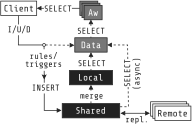

# CRDV

Proof-of-concept implementation of Conflict-free Replicated Data Views. The complete design can be found in the paper *CRDV: Conflict-free Replicated Data Views*, **SIGMOD 2025**. You can read it [here](https://nuno-faria.github.io/papers/crdv.pdf).

- [CRDV](#crdv)
  - [Getting started](#getting-started)
    - [Setup](#setup)
    - [Example usage](#example-usage)
  - [Architecture](#architecture)
    - [Default structures](#default-structures)
    - [Reading](#reading)
    - [Writing](#writing)
    - [Utility functions](#utility-functions)
    - [Nested structures](#nested-structures)
      - [Referential integrity](#referential-integrity)
    - [Sync and async mode](#sync-and-async-mode)
    - [Merge daemon](#merge-daemon)
  - [Testing](#testing)
  - [Benchmarks](#benchmarks)
    - [Setup](#setup-1)
    - [Run](#run)
    - [Results](#results)
  - [Reproducibility](#reproducibility)

## Getting started

### Setup

(Tested with PostgresSQL 16, Ubuntu 22.04.)

- Prepare one or more Postgres databases. The `deploy/install_postgres.sh` script can be used to install Postgres. Example:
  ```shell
  cd deploy
  sudo chmod +x install_postgres.sh
  ./install_postgres.sh
  ```
- Install the required extensions:
  ```shell
  # inside each server, execute:
  cd deploy
  sudo chmod +x install_extensions.sh
  ./install_extensions.sh
  ```
- Update the necessary server parameters (if using the `./install_postgres.sh` script, this step can be skipped):
  - The `wal_level` must be set to `logical`, and there must be enough workers to replicate data to all sites. E.g.:
    ```shell
    psql -h localhost -U postgres -c "ALTER SYSTEM SET wal_level = 'logical'"
    psql -h localhost -U postgres -c "ALTER SYSTEM SET max_logical_replication_workers = 100"
    psql -h localhost -U postgres -c "ALTER SYSTEM SET max_worker_processes = 100"
    psql -h localhost -U postgres -c "ALTER SYSTEM SET max_replication_slots = 100"
    psql -h localhost -U postgres -c "ALTER SYSTEM SET max_wal_senders = 100"
    # restart the system
    ```
- Init the cluster:
  - Update the `schema/cluster.yaml` file, adding the information of each site. If the `deploy/install_postgres.sh` script was used, the connection information in the following examples is already correct:
    Example of three databases in the same site (the `dbname` database will be used to connect to Postgres, and thus it must already exist).
    ```yaml
    connections:
    - connection:
        host: localhost
        port: 5432
        user: postgres
        password: postgres
        dbname: postgres
      targetDBs:
      - testdb1
      - testdb2
      - testdb3
    ```
    Example of multiple servers :
    ```yaml
    connections:
    - connection:
        host: 10.0.0.1
        port: 5432
        user: postgres
        password: postgres
        dbname: postgres
      targetDBs:
      - testdb
    - connection:
        host: 10.0.0.2
        port: 5432
        user: postgres
        password: postgres
        dbname: postgres
      targetDBs:
      - testdb
    ```
  - Install the Python requirements:
    ```shell
    sudo apt install -y python3-psycopg2 python3-yaml
    ```
  - Create the cluster:
    ```shell
    cd schema
    python3 createCluster.py cluster.yaml

    # should output:
    # ...
    # Cluster info
    #   Site 1: ...
    #   ...
    ```
  - To remove the cluster:
    ```shell
    cd schema
    python3 dropCluster.py cluster.yaml
    ```

### Example usage

- Writes to the same map, on different keys:
```sql
-- site 1 (e.g.: psql -U postgres -d testdb1)
SELECT mapAdd('m', 'k1', 'v1');

-- site 2 (e.g.: psql -U postgres -d testdb2)
SELECT mapAdd('m', 'k2', 'v2');

-- site 1
SELECT * FROM mapAwMvr;
 id |   data
----+-----------
 m  | (k1,{v1})
 m  | (k2,{v1})
```

- Concurrent writes on the same key:
```sql
-- site 1
BEGIN;
SELECT mapAdd('m', 'k3', 'v3');

-- site 2
BEGIN;
SELECT mapAdd('m', 'k3', 'v30');

-- site 1
COMMIT;

-- site 2
COMMIT;

-- site 1
-- using the add-wins + multi-value register rule
SELECT * FROM mapAwMvr;
 id |      data
----+-----------------
 m  | (k1,{v1})
 m  | (k2,{v1})
 m  | (k3,"{v3,v30}")

-- using the add-wins + last-writer-wins rule
SELECT * FROM mapAwLww;
 id |   data
----+----------
 m  | (k1,v1)
 m  | (k2,v1)
 m  | (k3,v30)
```

## Architecture



- **Shared** - table that stores versions and handles replication (a.k.a. *History*);
- **Local** - table that stores materialized data (a.k.a. materialized *Present*);
- **Data** - view that computes the versions in the causal present (simply scanning from Local, in *sync*, or reading for Local + Shared, in *async*; a.k.a. *Present*);
- **Aw**, **Rw**, **Mvr**, ... - views that apply conflict resolution rules to the data in the causal present.


### Default structures

We implement the following types, although more can be created:

- **Register** - an opaque value;
- **Set** - a collection of unique values, without order;
- **Map** - associates unique keys to values;
- **Counter** - an integer counter supporting increments and decrements;
- **List** - an ordered collection of values (duplicates allowed).


### Reading

When reading, we consider the following rules to handle conflicting writes, although more can be created:

- **Multi-value register** (*mvr*) - with conflicting writes, return all values;
- **Last-writer wins** (*lww*) - with conflicting writes, return only the most recent write;
- **Add-wins** (*aw*) - with conflicting adds and removes, favor the adds;
- **Remove-wins** (*rw*) - with conflicting adds and removes, favor the removes.

Each type offers two views for each concurrency rule supported: One returns data in the traditional relational format, i.e., one row per entry, while the other one stores the entire data in a single row.

For example, consider a set $S$ that has values $\{a, b, c\}$. The views *SetLww* and *SetLwwTuple* would return:

<table>
<tr>
  <th>SetLww</th>
  <th>SetLwwTuple</th>
</tr>
<tr>
  <td>

| id | data |
| - | - |
| S | a |
| S | b |
| S | c |

  </td>
  <td>

| id | data |
| - | - |
| S | {a, b, c} |

  </td>
</tr>
</table>

(Note: the above views return the data for all Sets in the database. To get a specific one, we must filter by its *id*.)


Below are the implemented read views for each type:

- **Register**
  - ***mvr*** - *RegisterMvr*;
  - ***lww*** - *RegisterLww*.
- **Set**
  - ***aw*** - *SetAw*, *SetAwTuple*;
  - ***rw*** - *SetRw*, *SetRwTuple*;
  - ***lww*** - *SetLww*, *SetLwwTuple*.
- **Map**
  - ***aw + mvr*** - *MapAwMvr*, *MapAwMvrTuple*;
  - ***aw + lww*** - *MapAwLww*, *MapAwLwwTuple*;
  - ***rw + mvr*** - *MapRwMvr*, *MapRwMvrTuple*;
  - ***lww*** - *MapLww*, *MapLwwTuple*.
- **Counter**
  - *Counter*.
- **List**
  - *List*, *ListTuple*.

Instead of directly querying the views, we can also use [utility functions](#utility-functions) instead.


### Writing

To write data, we simply perform an insert to the view *Data* with the respective information:
  - `id` - the structure's identifier;
  - `key` - the element identifier:
    - registers - not used, can be set to empty;
    - sets - identifies the value being added/removed;
    - maps - identifies the map key being added/removed;
    - lists - identifies the list index being modified.
  - `type` the structure type (`r(register)|s(set)|m(map)|c(counter)|l(list)`);
  - `data` - the data being written (`null` for remove operations);
  - `site` - the site's integer identifier;
  - `lts` - the operations logical timestamp (vector clock);
  - `pts` - the operations physical timestamp (hybrid logical clock);
  - `op` - the operation type (`a(add)|r(rmv)`)


Just like for reading, we can use [utility functions](#utility-functions) instead of directly writing to the Data view.

### Utility functions

These functions can be used to read and write data to the various structures. In each function, the `id` parameter represents the structure's identifier. The structure is automatically created if it does not exist.

- **Register**
  - `register[Mvr|Lww]Get(id)` - get a register's value by id;
  - `registerSet(id, value)` - set a register's value.
- **Set**
  - `set[Aw|Rw|Lww]Get(id)` - get a set by id;
  - `set[Aw|Rw|Lww]Contains(id, elem)` - check if a set contains an element;
  - `setAdd(id, elem)` - add an element to a set;
  - `setRmv(id, elem)` - remove an element from a set;
  - `setClear(id)` - removes all elements from a set.
- **Map**
  - `map[AwMvr|AwLww|RwMvr|Lww]Get(id)` - get a map by id;
  - `map[AwMvr|AwLww|RwMvr|Lww]Value(id, key)` - get a map value by its key;
  - `map[AwMvr|AwLww|RwMvr|Lww]Contains(id, key)` - check if a map contains some key;
  - `mapAdd(id, key, value)` - add a key-value entry to the map (if the key exists, replaces the value with the new one);
  - `mapRmv(id, key)` - remove a key-value entry from the map;
  - `mapClear(id)` - removes all entries from a map.
- **Counter**
  - `counterGet(id)` - get a counter value by id;
  - `counterInc(id, delta)` - increment a counter by delta units;
  - `counterDec(id, delta)` - decrement a counter by delta units;
- **List**
  -  `listGet(id)` -- get a list by id;
  -  `listGetAt(id, index)` -- get a list's element at a specific index;
  -  `listGetFirst(id)` -- get the first element of the list;
  -  `listGetLast(id)` -- get the last element of the list;
  -  `listAdd(id, i, elem)` -- insert an element to a list at position $i$ ($i \in [0, \infty]$);
  -  `listAppend(id, elem)` -- append an element at the end of the list;
  -  `listPrepend(id, elem)` -- append an element at the start of the list;
  -  `listRmv(id, i)` -- remove the list element at position $i$ ($i \in [0, \infty]$);
  -  `listPopFirst(id)` -- remove the first element of the list;
  -  `listPopLast(id)` -- remove the last element of the list;
  -  `listClear(id)` -- removes all elements from a list.


### Nested structures

We can model structures inside structures by storing in the *data* column the *id* of the inner structure. For example, to represent a map of sets, we can do the following:

```sql
SELECT setAdd('s1', 'a');
SELECT setAdd('s1', 'b');
SELECT setAdd('s2', 'c');
SELECT setAdd('s2', 'd');
SELECT mapAdd('m1', 'k1', 's1');
SELECT mapAdd('m1', 'k2', 's2');
```

To read the data, we can perform a join of the respective views. For example, MapAwLww -> SetAw:

```sql
SELECT t0.id AS m, (t0.data).key AS k, t1.id AS s, t1.data AS data
FROM MapAwLww AS t0,
LATERAL (SELECT * FROM SetAw WHERE id = (t0.data).value OFFSET 0) AS t1
WHERE t0.id = 'm1';

 m  | k  | s  | data
----+----+----+------
 m1 | k1 | s1 | a
 m1 | k1 | s1 | b
 m1 | k2 | s2 | c
 m1 | k2 | s2 | d
```

For convenience, we can use the `schema/nested_views.py` script to generate the JSON representation of any sequence of views. For example:

```shell
python3 schema/nested_views.py MapAwLww SetAw
```
, which returns:

```sql
SELECT id0 as id, data
FROM (
  SELECT id0, jsonb_object_agg(key0, data) AS data
  FROM (
    SELECT id0, key0, id1, jsonb_agg(data) AS data
    FROM (
      SELECT t0.id AS id0, (t0.data).key AS key0, t1.id AS id1, t1.data AS data
      FROM MapAwLww AS t0,
      LATERAL (SELECT * FROM SetAw WHERE id = (t0.data).value OFFSET 0) AS t1
    ) t
    GROUP BY 1, 2, 3
  ) t
  GROUP BY 1
) t
WHERE id0 = 'm1'; -- selection manually added

 id |                 data
----+--------------------------------------
 m1 | {"k1": ["a", "b"], "k2": ["c", "d"]}
```

#### Referential integrity

To ensure referential integrity in nested structures -- e.g., `a` is a map of courses that references a list of students `b` by key `k`; adding a new student to `b` and concurrently removing `b` from `a` results in a conflict, since now `b` does not exist in `a` -- we can force an update on the linked structure in the same transaction that performs the modification. For instance, when updating `b`, we would also mark `b` as added in `a`. Then, the Aw or Rw views would consistently dictate if `b` exists or not. While this can done manually, we can also use the following utility function:

```sql
-- src: id+key of the outer structure element (e.g., some map entry)
-- dst: id of the inner structure (e.g., map id)
-- addFunc: the name of the add utility function on the outer structure (mapAdd, setAdd, listAdd)
add_referential_integrity(src varchar[], dst varchar, addFunc varchar);

-- e.g., an update to set s1 forces a mapAdd of k1 to m1
SELECT add_referential_integrity('{m1, k1}', 's1', 'mapAdd');
```

To remove the constraint, we can execute the following function:

```sql
rmv_referential_integrity(src varchar[], dst varchar);

-- e.g.
SELECT rmv_referential_integrity('{m1, k1}', 's1');
```

(Note: since we implement every structure in the same table, theses constraints are applied to specific rows. However, this could also be designed to add a constraint based on the column, much like regular SQL constraints.)


### Sync and async mode

We consider two different write modes: *sync* and *async*. With *sync*, local versions are written to the Local table, forcing the merge before returning to the client. *Async* writes to Shared and returns immediately, while the merge is done asynchronously with a background process.

To change the write mode, we can call `switch_write_mode` procedure:

```sql
-- sync (default)
SELECT switch_write_mode('sync');

-- async
SELECT switch_write_mode('async');
```

However, when executing with the *async* mode, we must take into consideration the data from both the Local and Shared tables. As such, the *async* mode should be executed together with the *all* read mode, while the *sync* mode should use the *local* one. To change the read mode, we can call `switch_read_mode` procedure:

```sql
-- local (default)
SELECT switch_read_mode('local');

-- all
SELECT switch_read_mode('all');
```


### Merge daemon

Remote operations (and local *async* ones) are moved from Shared to Local with a periodic merge daemon. This daemon is already running by default when the cluster is initialized, but needs to started when the system restarts.

We can check if the daemon is running by querying the `pg_stat_activity` table:

```sql
SELECT datname, pid, state, query
FROM pg_stat_activity
WHERE state <> 'idle'
    AND query NOT LIKE '% FROM pg_stat_activity %'
    AND query LIKE '%merge_daemon%';

 datname | pid | state  |            query
---------+-----+--------+------------------------------
 testdb1 | 513 | active | CALL merge_daemon(1, 1, 100)
 testdb2 | 516 | active | CALL merge_daemon(1, 1, 100)
 testdb3 | 519 | active | CALL merge_daemon(1, 1, 100)
```


To start/restart the daemon, we can use the following procedure:

```sql
SELECT schedule_merge_daemon(merge_parallelism, merge_delta, merge_batch);

-- example
SELECT schedule_merge_daemon(1, 1, 1000);
```

- `merge_parallelism` - number of workers executing the merge;
- `merge_delta` - sleep between merges;
- `merge_batch` - max number of rows merged in the same transaction (rows from the same transaction are always merged in the same batch). A small number will result in many fsyncs to disk, while a large number can hold locks for a longer duration.


To stop the merge daemon, usually for debug purposes, we use the following procedure:

```sql
SELECT unschedule_merge_daemon();
```

## Testing

We provide several types of tests:

- Functional tests to evaluate type semantics, with a single client in a single site:
  ```shell
  # example
  python3 tests/data-types.py -d testdb1

  # execute with -h for help.
  python3 tests/data-types.py -h
    usage: data-types.py [-h] [-H HOST] [-p PORT] [-d DATABASE] [-u USER] [-P PASSWORD] [-m MODE]

    options:
      -h, --help            show this help message and exit
      -H HOST, --host HOST  Database host (default: localhost)
      -p PORT, --port PORT  Database port (default: 5432)
      -d DATABASE, --database DATABASE
                            Database name (default: testdb)
      -u USER, --user USER  Username (default: postgres)
      -P PASSWORD, --password PASSWORD
                            Password (default: postgres)
      -m MODE, --mode MODE  Execution mode: sync vs async writes (default: sync)
  ```

- Functional tests to evaluate concurrency and replication, with multiple clients in multiples sites:
  ```shell
  # example
  python3 tests/concurrency.py -d testdb1 testdb2 testdb3

  # execute with -h for help.
  python3 tests/concurrency.py -h
    usage: concurrency.py [-h] [-H HOST] [-p PORT] [-d DATABASES [DATABASES ...]] [-u USER] [-P PASSWORD] [-m MODE]

    options:
      -h, --help            show this help message and exit
      -H HOST, --host HOST  Database host (default: localhost)
      -p PORT, --port PORT  Database port (default: 5432)
      -d DATABASES [DATABASES ...], --databases DATABASES [DATABASES ...]
                            List of database names (each one will be a different site; minimum of three) (default:
                            ['testdb1', 'testdb2', 'testdb3'])
      -u USER, --user USER  Username (default: postgres)
      -P PASSWORD, --password PASSWORD
                            Password (default: postgres)
      -m MODE, --mode MODE  Execution mode: sync vs async writes (default: sync)
  ```

- Functional tests for nested structures:
  ```shell
  # example
  python3 tests/nested.py -d testdb1

  # execute with -h for help.
  python3 tests/nested.py -h
    usage: nested.py [-h] [-H HOST] [-p PORT] [-d DATABASE] [-u USER] [-P PASSWORD] [-m MODE] [-n N]

    options:
      -h, --help            show this help message and exit
      -H HOST, --host HOST  Database host (default: localhost)
      -p PORT, --port PORT  Database port (default: 5432)
      -d DATABASE, --database DATABASE
                            Database name (default: testdb)
      -u USER, --user USER  Username (default: postgres)
      -P PASSWORD, --password PASSWORD
                            Password (default: postgres)
      -m MODE, --mode MODE  Execution mode: sync vs async writes (default: sync)
      -n N                  Number of tests (default: 100)
  ```

To execute them, the cluster must already exist.


## Benchmarks

**Note**: To reproduce the original paper's results, please check the [Reproducibility](#reproducibility) section.

We implement several benchmarks to both test our solution and compare against alternatives.

(Tested on Ubuntu 22.04.)

### Setup

- If a CRDV cluster already exists, drop it first:
  ```shell
  cd schema
  python3 dropCluster.py cluster.yaml
  ```

- Install the database systems, metric server, and network partition server (in each server used):
  ```shell
  cd deploy
  sudo chmod +x *.sh
  ./install_postgres.sh # installs postgres 16 and 15 (pg_crdt)
  ./install_extensions.sh
  ./install_electric.sh
  ./install_riak.sh
  ./install_pg_crdt.sh
  ./install_metrics_server.sh # to measure the network usage in the network tests
  ./install_network_partition_server.sh # to partition the network in the delay tests
  ./install_python.sh
  ```

- Update the config files:
  - Update the `deploy/connections.yaml` with the information of the various servers. While CRDV and Riak can be deployed with multiple sites, the others are single-instance only in our tests. To make the process easier, the `deploy/update_connections.py` script updates the `deploy/connections.yaml` file based on a list of hostnames passed as argument. Example:
    ```shell
    # localhost ('hostname -I' for riak)
    python3 update_connections.py connections.yaml --all $(hostname -I)

    # three sites with ips 10.0.0.1, 10.0.0.2, and 10.0.0.3
    python3 update_connections.py connections.yaml --all 10.0.0.1 10.0.0.2 10.0.0.3
    ```
  - Update the config files (`schema/cluster.yaml` and benchmarks) with the `deploy/update_configs.py` script:
    ```shell
    python3 update_configs.py connections.yaml
    ```

- To setup the CRDV cluster:
  ```shell
  cd schema
  python3 createCluster.py cluster.yaml

  # to deploy CRDV using a ring topology (used in the multiple-sites tests)
  python3 createCluster.py cluster.yaml ring
  ```

- To setup Riak (using Multi-Datacenter Replication):
    - In each site, execute the following commands:
      ```shell
      cd deploy/riak;
      ./run.sh 1
      ./create-bucket-types.sh 1
      # replace id with the cluster id (C1, C2, ..., Cn)
      ./repl-prepare.sh C<id>
      ```
      (Note: Riak cannot be deployed on Oracle VirtualBox virtual machines due to `Monotonic time stepped backwards!` type errors.)

    - If using multiple sites:
      - In each site, connect to the other clusters:
        ```shell
        cd deploy/riak
        # replace <other-id> and <other-ip> with the id and ip of the other cluster
        ./repl-connect.sh C<other-id> <other-ip>
        # e.g. "./repl-connect.sh C2 10.0.0.2" at C1 and "./repl-connect.sh C1 10.0.0.1" at C2
        ```

      - Check the connections in each site:
        ```shell
        ./repl-connections.sh
        ```

    - To clear the data without destroying the cluster:
      ```shell
      cd deploy/riak
      ./reset.sh
      ```

    - To destroy the cluster and stop riak:
      ```shell
      cd deploy/riak
      ./destroy.sh
      ```

- To start electric:
  ```shell
  cd deploy/electric
  ./run.sh
  ```

- Prepare the benchmark client:
  ```shell
  cd deploy
  sudo chmod +x *.sh
  ./install_python.sh
  ./install_go.sh
  source $HOME/.profile

  cd ../benchmarks
  sudo chmod +x *.sh
  ```

### Run

Inside the `benchmarks` folder, there are several scripts to run various tests:
- `./run_timestamp_encoding.sh` (-) - tests various timestamp encoding strategies;
- `./run_micro_rw.sh` (CRDV) - tests the different materialization strategies with a dynamic workload;
- `./run_nested.sh` (CRDV) - tests the performance of reads to nested structures;
- `./run_micro.sh` (all systems) - tests the delay of reads and writes to various CRDTs;
- `./run_micro_concurrency.sh` (all systems) - tests the performance under write hotspots;
- `./run_micro_storage.sh` (all systems) - tests the storage overhead;
- `./run_micro_storage_sites.sh <engine>` (CRDV, Riak, Electric) - tests the storage overhead based on the number of sites;
- `./run_micro_network.sh` (CRDV, Riak, Pg_crdt) - tests the network overhead;
- `./run_delay.sh` (CRDV, Riak, Pg_crdt) - tests the delay (number of missing operations) over time;
- `./run_micro_scale.sh` (CRDV and Riak) - tests the performance across multiple sites.

Each script stores the raw files and plots in the `benchmarks/results` folder. Each script also contains at the top some configurations that can be updated.

(Note: At least for the `run_micro_network.sh` and `run_delay.sh` tests the client should be deployed on a separate instance.)


### Results

Results can be found in the [results](/results) folder.


## Reproducibility

Reproducibility instructions can be found in the [reproducibility](/reproducibility) folder.
